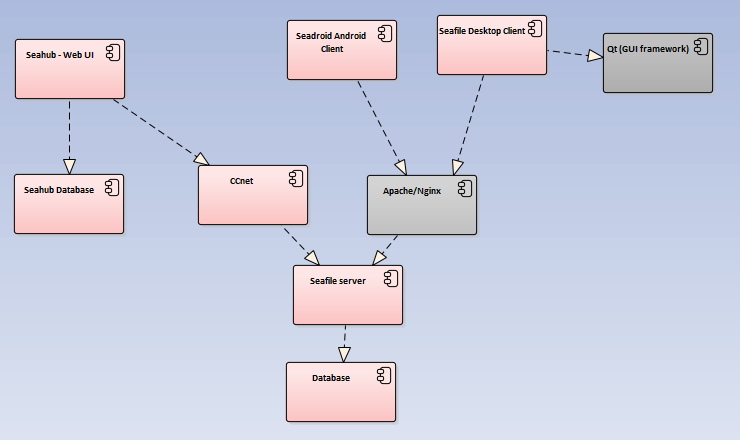
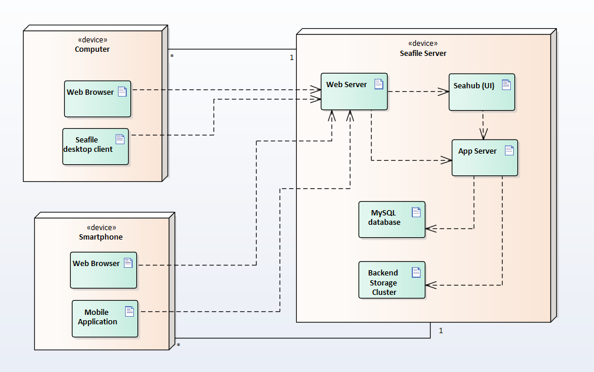
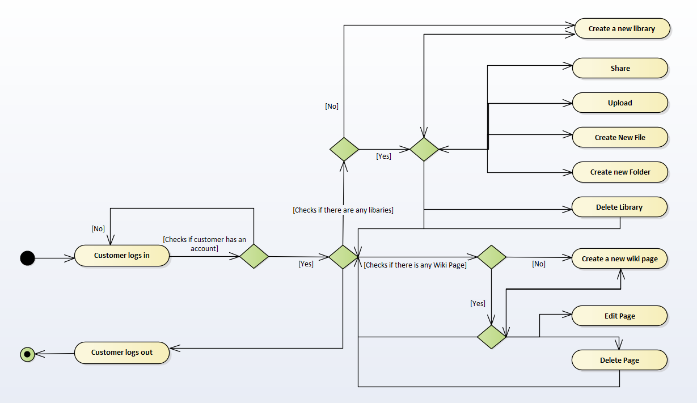

### **Engenharia de Software - Relatório 3**

<a name="index"/>
## **Índice**
1. [Introdução](#introduction)
2. [Vista Lógica](#logicalview)
3. [Vista de Implementação](#implementationview)
4. [Vista de Distribuição](#deploymentview)
5. [Vista de Processo](#processview)
6. [Contribuição do Grupo](#contribuition)

---
<a name="introduction"/>
## **Introdução**

Arquitetura de software é a organização fundamental de um sistema, incorporado pelos seus componentes, relações entre entre eles e o meio envolvente e os princípios que governam o design do sistema e a sua evolução.
Existem dois padrões de arquitetura do sistema, claramente notórios e suportados pelos diagramas abaixo apresentados:

#### **Arquitetura por camadas**

Este estilo de arquitetura carateriza-se pela organização do sistema em diferentes camadas, que por sua vez comunicam com as camadas inferiores. A relação entre estas pode ser de modo *"strict"* ou *"relaxed"*. Neste caso específico foi aplicado o modo *"relaxed"*, que não obriga a comunicação com a camada imediatamente a seguir (como acontece com o modo *"strict"*).

Vantagens:

- Suporta o desenvolvimento incremental camada a camada;
- Permite o isolamento das camadas inferiores e inter camadas;

Desvantagens:

- Dificuldade na separação clara das camadas;

#### **Arquitetura cliente-servidor**

Este estilo caracteriza-se por permitir a comunicação entre um ou mais clientes que efetuam pedidos a um servidor.
Neste projecto em específico é usado um padrão *"4-tier"* (4 camadas) que se dividem em:

- Cliente
- Web
- Aplicação (server)
- Dados

Vantagens:

- Servidores podem ser distibuidos e replicados por uma rede;
- Permite o uso de funcionalidades gerais e acesso a informação comum por parte dos clientes;

Desvantagens:

- Possível falha dos serviços por inacessibilidade do servidor ou por ataques;
- Performance não é previsível porque depende de diversos fatores como a rede além do sistema em si;
- Possíveis problemas de gestão se os servidores pertencerem a empresas diferentes;

---
<a name="logicalview"/>
## **Vista Lógica**

---
<a name="implementationview"/>
## **Vista de Implementação**
A vista de implementação ilustra um sistema da prespetiva de um programador e preocupa-se com a gestão do software. Esta vista usa o digrama de componentes para descrever os componentes do sistema. Um componente representa uma parte modular de um sistema que encapsula os seus constituintes.

---
<a name="deploymentview"/>
## **Vista de Distribuição**
Os diagramas de distribuição em UML modelam a arquitetura física de um sistema e mostram a interação das componentes de *software* com o *hardware* do sistema.

---
<a name="processview"/>
## **Vista de Processo**
Os diagramas de atividade são importantes para descrever aspetos dinâmicos do sistema. Têm como objetivo representar o fluxo de atividade do sistema, descrever a sequência de atividades e descrever o fluxo paralelo e concorrente do sistema.
O principal elemento de um diagrama de atividade é a atividade em si, sendo esta uma função desempenhada pelo sistema. Também existem outros elementos, como associações, condições ou ainda restrições.

---
<a name="contribuition"/>
## **Contribuição do Grupo**

