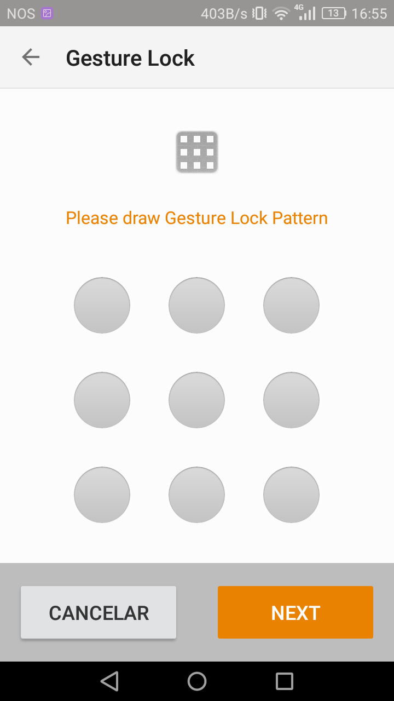

### **Engenharia de Software - Relatório 4**

<a name="index"/>
## **Índice**
1. [Introdução](#introduction)
2. [Software Testability and Reviews](#testability)
3. [Estatísticas e análise dos testes](#tests)
4. [Bugs e correção](#bug)
5. [Contribuição do Grupo](#contribuition)

---
<a name="introduction"/>
## **Introdução**

O objetivo deste relatório consiste em analisar os processos de verificação e validação seguidos no desenvolvimento da aplicação android do *Seafile*.
Deste modo, irá ser explorada a testabilidade do *software*, analisando os graus de controlabilidade, de observabilidade, de isolabilidade, de separação, de inteligibilidade e de heterogeneidade associados aos componentes do projeto.
Posto isto, serão apresentadas estatísticas relativas à verificação e validação do *software*, como por exemplo, o número de testes.
Por fim, será revelado o processo efetuado para a correção do *bug* escolhido pelo grupo.

---
<a name="testability"/>
## **Testabilidade do *Software***

Our chosen project only have 2 tests on the android application, which within those tests they make a relation of true or false 11 times total.
The coverage we see on the project is low, on class we have 36% (4/11), on method 9% (6/66) and on line there are 4% (22/503).
With only 2 tests we have on the project, one of them fails and the other ones is ok.
O nosso projeto apenas tem 2 teste na aplição de android. A coverage do codigo é muito baixa, nas classes apenas 36%(4/11), nos métodos(6/66) e nas linhas  4%(22/503).


**Controlabilidade**

A controlabilidade corresponde ao grau de facilidade com que é possível controlar o estado de uma *CUT* (*Component Under Test*).

Relativamente à aplicação android do *Seafile* (*Seadroid*), uma vez que é possível aceder às propriedades de um objeto, tanto aos seus métodos como atributos, com relativa facilidade, num dado instante, é razóavel
admitir que é possível controlar o estado do mesmo.

Contudo, esta aplicação móvel interage com outros módulos, relativos ao servidor do *Seafile*, o que dificulta, assim, o acesso aos componentes e integrantes dos mesmos. Deste modo, pode considerar-se que, neste caso, existe uma controlabilidade reduzida.

**Observabilidade**

Quanto maior é a facilidade em verificar os resultados de um teste, maior é o grau de observabilidade de um software.

O *Seadroid* utiliza a *framework* ***Robolectric*** que possibilita não só a escrita de testes unitários, mas também permite que os testes unitários sejam executados sem que um emulador seja necessário. O *Robolectric* possibilita a execução de apenas um teste unitário ou de todos os testes. 

Com a utilização desta *framework* é fácil observar os resultados dos vários testes incluídos no projeto, como se pode observar na seguinte imagem:


Outra ferramenta utilizada pela aplicação é ***Travis CI***. Esta ferramenta é usada para realizar testes de intregração sobre o código submetido pelos vários colaboradores e permite a observação do resultado dos vários testes realizados.


**Isolabilidade**

A isolabilidade refere-se ao grau em que um CUT pode ser testado isoladamente.

Considerando o *Seadroid* um módulo do *Seafile*, as dependências são demasiadas o que dificulta o isolamento dos testes que dependam de módulos exteriores.

Por exemplo, se se pretender testar uma função do *Seadroid* que utilize uma outra função do *Seafile*, mesmo que a função do primeiro esteja completamente correta, o teste pode falhar.


**Separação de tarefas**

A separação de tarefas é um aspeto crucial na elaboração de qualquer projeto, principalmente projetos com maior visibilidade e dimensão. Não dar a devida atenção a este aspeto resulta numa difícil manutenção e desenvolvimento do projeto.

Relativamente ao *Seadroid*, pode considerar-se que o projeto está muito bem estruturado. Existem *packages* para cada componente, com classes e métodos respetivos às mesmas. Funcionalidades mais complexas são divididas em funcionalidades menores e mais simples.


**Inteligibilidade**

Tanto o *Seadroid* como o *Seafile* não apresentam documentação disponível.

Contudo, devido à eficiente separação de tarefas, o código é percetível. Um outro aspeto fundamental que contribui para a inteligibilidade de cada secção de código, é a evidência na escolha de nomes, tanto dos *packages*, como das classes e métodos.


**Heterogeneidade**

O *Seadroid* é um projeto com uma heterogeneidade considerável, visto que são várias as tecnologias externas utilizadas. Estas tecnologias estão declaradas na lista de dependências do ficheiro que permite a compilação do programa. As principais tecnologias são:

- *JUnit*;
- *Http Request*;
- *Robolectric*;
- *Travis CI*.

Apesar da clara vantagem de implementação das funcionalidades que estas ferramentas disponibilizam, existem algumas adversidades. Aquando a utilização de uma tecnologia não tão conhecida nem fiável, é necessário desenvolver testes para cobrir eventuais falhas.
 

---
<a name="tests"/>
## **Estatísticas e análise dos testes**


Como já referido anteriormente, uma plataforma utilizada pelo Seadroid é **Travis CI**.
Esta plataforma permite garantir que todos os commits e pull requests podem ser integrados no código atual sem o afetar através da realização de builds automáticas.

Ficheiro para a criação de builds automatizadas (*.travis.yml*):

```yaml
# http://docs.travis-ci.com/user/languages/android/
language: android

sudo: false
jdk: oraclejdk8
android:
  components:
      - tools
      - platform-tools
      - build-tools-23.0.2
      - android-23
      - extra-android-support
      - extra-android-m2repository
 
script:
    - cp app/key.properties.example app/key.properties
    - cp app/key.properties.example app/debugkey.properties
    - keytool -genkey -v -keystore app/debug.keystore -alias AndroidDebugKey -keyalg RSA -keysize 2048 -validity 1 -storepass android -keypass android -dname "cn=TEST, ou=TEST, o=TEST, c=TE"
    - ./gradlew clean assemble


# reference https://docs.travis-ci.com/user/languages/android
```

Atualmente a versão atual do github encontra-se com a **build failing** (<https://travis-ci.org/haiwen/seadroid>).
O projeto tinha por vezes versões que não passavam na build mas eram corrigidas, voltando a passar. Nos últimos dois meses todas as integrações de código têm falhado e motivo não é conhecido por nós pois os comentários aos commits são inconclusivos.

---
<a name="bug"/>
## **Bugs e correção**

### **Bug #1**

O primeiro bug detetado fazia com que a aplicação quando estava no ecrã das contas e não havia nenhuma conta atual permitia carregar no botão *back* que provocava a destruição da *activity* atual, a criação da *activity* que mostra os ficheiros de uma conta seguida da sua destruição e da criação de uma nova *activity* de contas.

A correção do bug passou por esconder o botão *back*  enquanto não houver qualquer conta ou não houver uma conta atual selecionada

**Commits associados à correção:**

https://github.com/haiwen/seadroid/pull/601/commits/c221487d5964ba2a289d8bb65aafb1328e48ee35
https://github.com/haiwen/seadroid/pull/601/commits/410f7bdf8087ab4fbee6f50b98931d8365663b6c

**Imagens da solução corrigida:**


--

### **Bug #2**

O segundo bug detetado foi encontrado no ecrã das definições e fazia com que o botão *switch* do padrão de desbloqueio ficasse sempre ativo ainda que não houvesse nenhum padrão definido. O seguinte acontecia quando se cancelava ou se retrocedia a partir da página para definição de um novo padrão de desbloqueio.

O bug foi corrigido fazendo a interpretação do valor de retorno da página acima referida, e implementar valores de retorno diferentes na página.

**Commits associados à correção:**

https://github.com/haiwen/seadroid/pull/601/commits/4a9ec855dec5897d0c2149c4540e0d7b3ce5278d

**Imagens da solução corrigida:**




--

### **Bug #3**

O terceiro bug detetado permitia repetir a introdução do padrão de desbloqueio mais de 5 vezes sem ter de esperar os 30 segundos exigidos.

A correção do bug passou por esconder o botão *back* que permitia fazer *reset* no timer de 30 segundos.

**Commits associados à correção:**

https://github.com/haiwen/seadroid/pull/601/commits/93528cdbbdad95713ad63b89eeae2973373fa65f

**Imagens da solução corrigida:**


--

O estado atual do **PULL REQUEST** pode ser consultado em https://github.com/haiwen/seadroid/pull/601 .

---
<a name="contribuition"/>
## **Contribuição do Grupo**

A contribuição de todos os elementos do grupo foi igual.
