### **Engenharia de Software - Relatório 5**

<a name="index"/>
## **Índice**
1. [Introdução](#introduction)
2. [Manutenção do Software](#manutencao)
3. [Nova feature](#feature)
4. [Pull Request](#pullrequest)
5. [Contribuição do Grupo](#contribuition)

---
<a name="introduction"/>
## **Introdução**

O *Seafile* é um projeto que tem vindo a ser desenvolvido desde 2012, encontrando-se num estado já bastante maturo, o que dificulta a adição de novas funcionalidades ao projeto. Contudo, o projeto está aberto ao desenvolvimento de novas funcionalidades desde que estas vão de encontro com os interesses do mesmo. Ao longo deste relatório, será descrito todo o processo envolvido na implementação desta nova *feature*.

---
<a name="manutencao"/>
## **Manutenção do Software**

### Análise métrica do *Better Code Hub* 

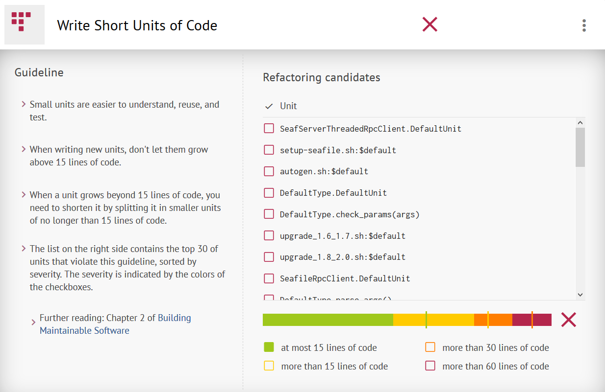

Como é possível observar pela imagem acima, na barra colorida, existe uma parte do código considerável que peca pela falta de divisão e estruturação, o que dificulta não só a sua compreensão, mas também a reutilização e testabilidade do código.

-

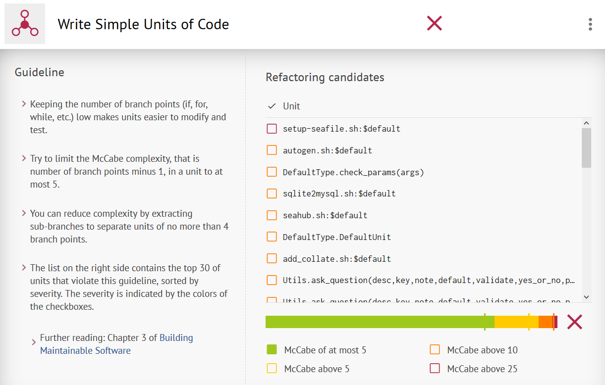

Verifica-se um problema semelhante ao anterior. Apesar da secção de código demasiado complexo corresponder a uma pequena percentagem, esta ultrapassa a linha do considerável, o que traz problemas semelhantes ao mencionados em cima.

-

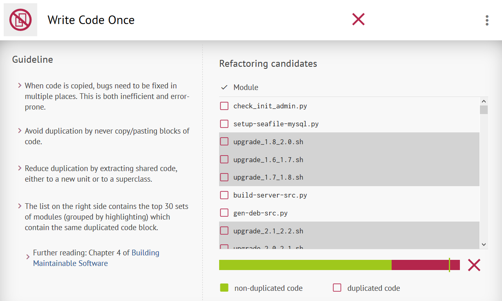

Mais uma vez, o *Seafile* revela problemas a nível de estruturação: a existência de código repetido.

-

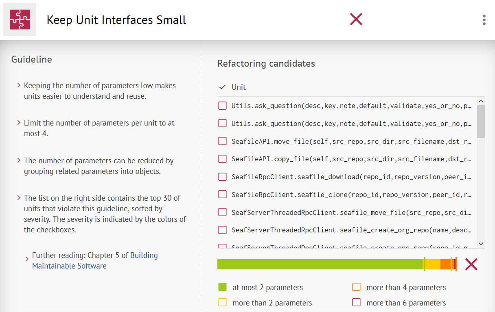

Apesar do código não passar nesta *guideline*, a percentagem que contribui para um mau resultado é pequena.

-

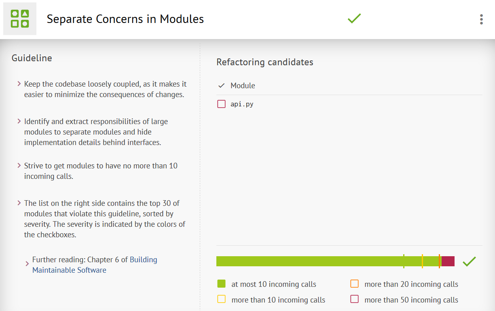

Neste aspeto, o *Seafile* apresenta resultados positivos, pois há uma boa divisão de módulos.

-

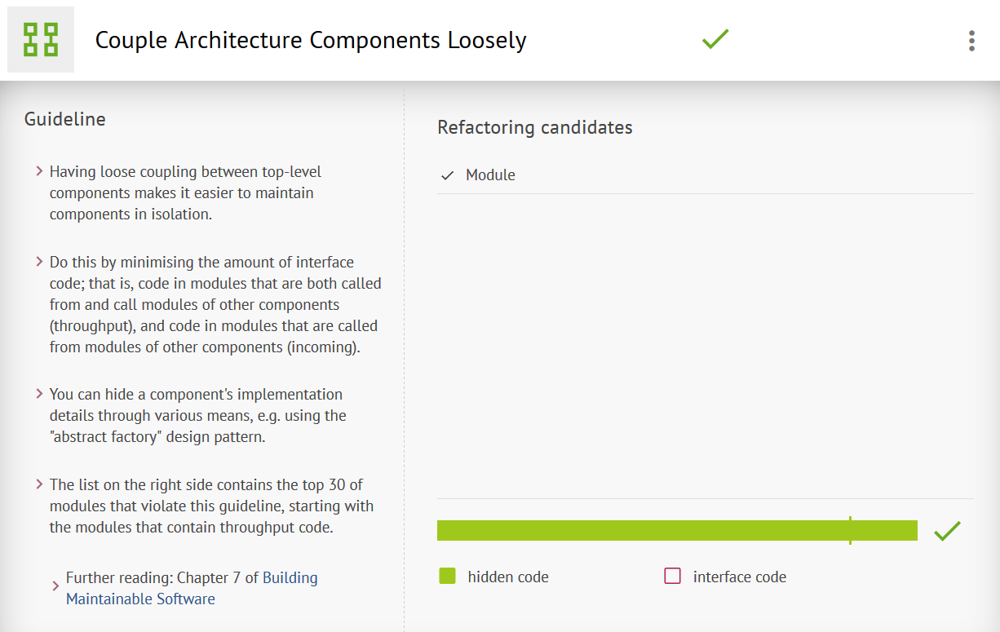

Nesta área, o *Seafile* apresenta resultados bastante satisfatórios, mostrando uma independência de 100% dos *components*.

-

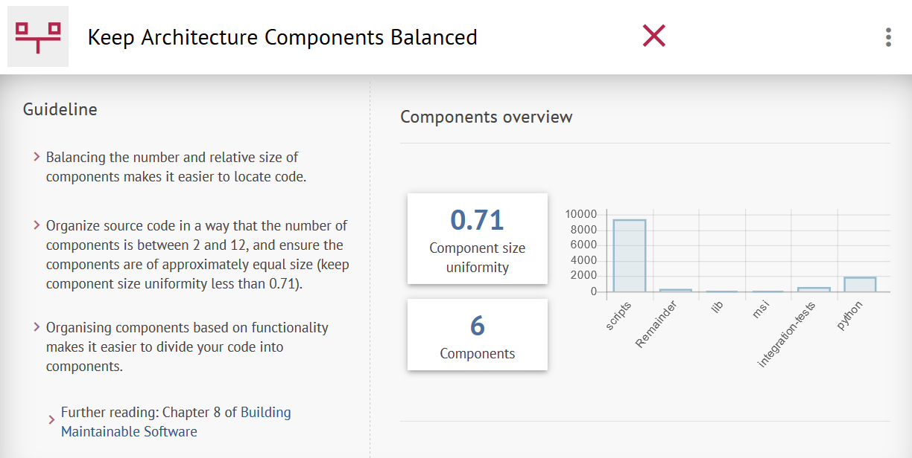

Observando a imagem em cima, pode verificar-se que o *component scripts* é bastante mais pesado que os restantes, o que provoca um certo desequilíbrio entre os vários *components*. Contudo, se tivermos atenção aos restantes *components*, podemos verificar que não há um grande desfasamento entre eles.

-

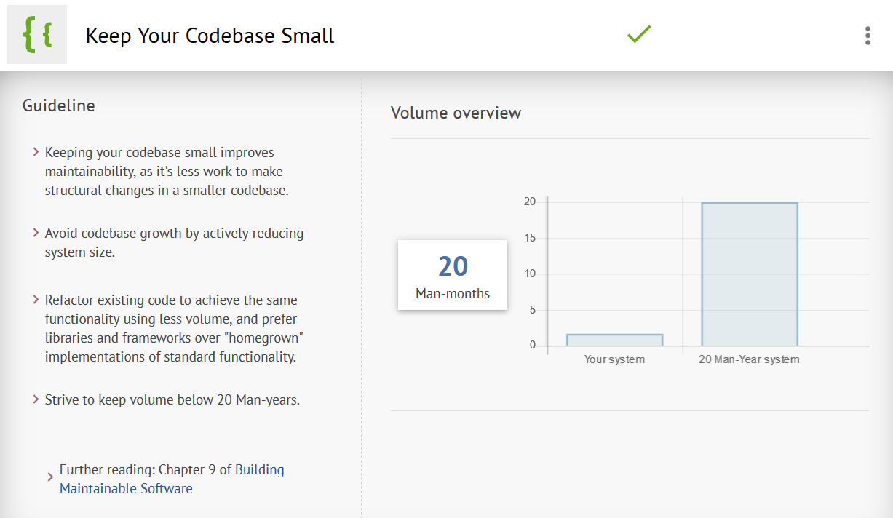

Pode observar-se que o *Seafile* passa nesta *guideline*, o que revela que a manutenção de código não constitui um obstáculo.

-

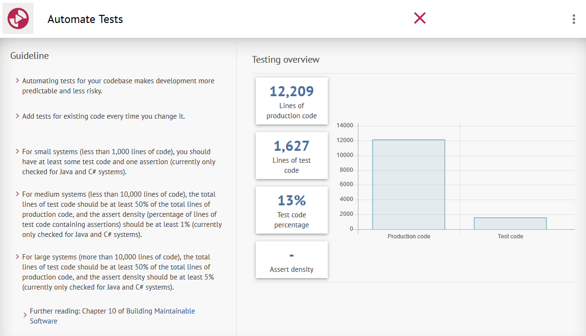

Como foi referido no relatório anterior, o *Seafile* deixa muito a desejar quanto à cobertura dos testes que apresenta. Tendo em conta a dimensão do projeto, a quantidade de testes existentes deveria ser muito superior.

-

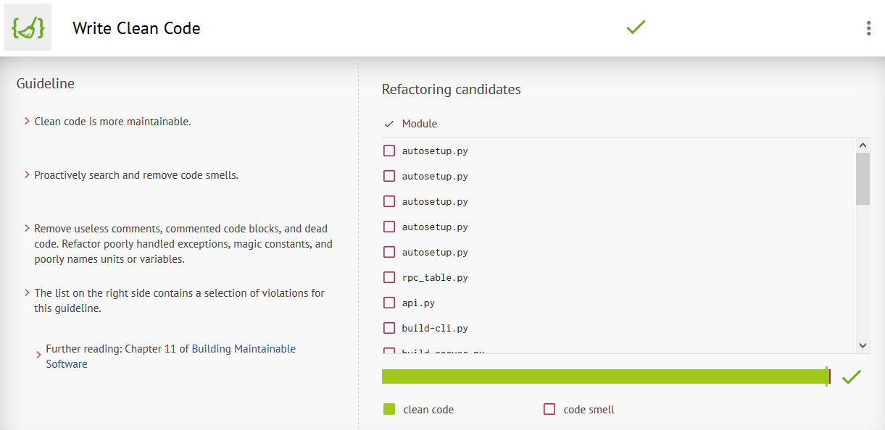

Neste campo, pode verificar-se que existe um atenção especial por parte da equipa para manter o seu código limpo e sem *code smells*, o que facilita, desta forma, a manutenção do projeto.

---
<a name="feature"/>
## **Nova feature**
### **Captura de vídeo e upload direto**

#### **Descrição**

A feature implementada trata-se da adição da possibilidade aos utilizadores da aplicação *android* de capturarem um vídeo e fazerem upload para a sua *library* diretamente a partir da aplicação. As capturas de ecrã a seguir apresentadas descrevem a *feature* desenvolvida.

Novo botão *"Capture a video"* que permite aos utilizadores acederem à câmara para gravação do vídeo:

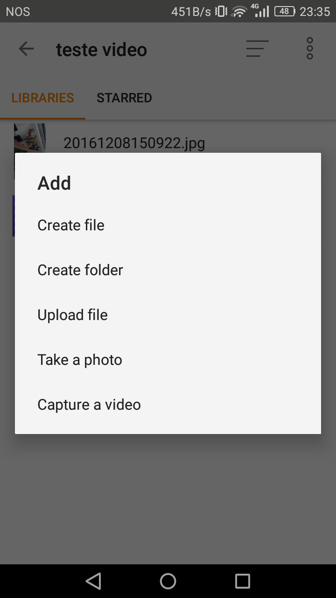


A aplicação executa a câmara em modo vídeo permitindo os utilizadores fazerem a gravação do vídeo com todas as funcionalidades permitidas pelos seus smartphones:

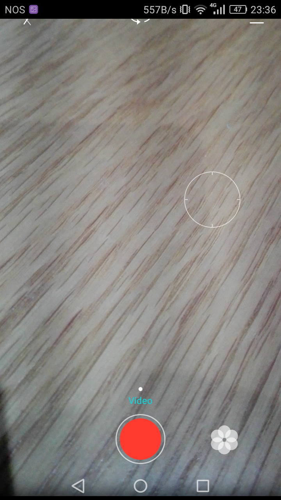


Após a gravação do vídeo é permitido aos utilizadores reverem a gravação e confirmar ou descartar a mesma:

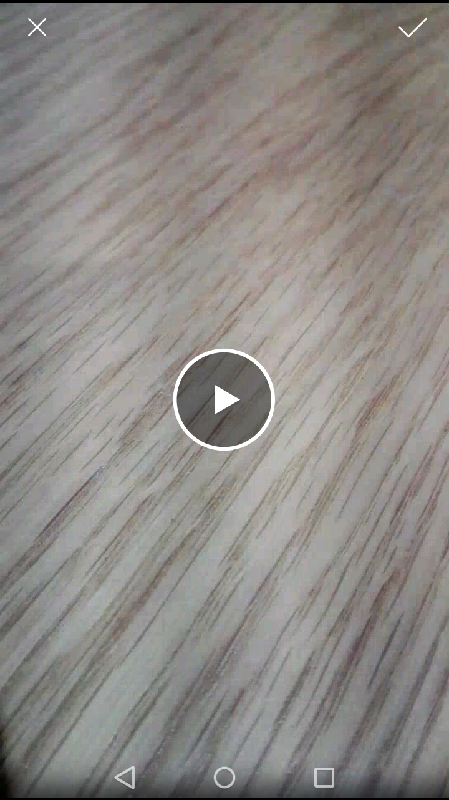


Se a gravação for validada começa então a ser feito o seu *upload* para a *library* pretendida:

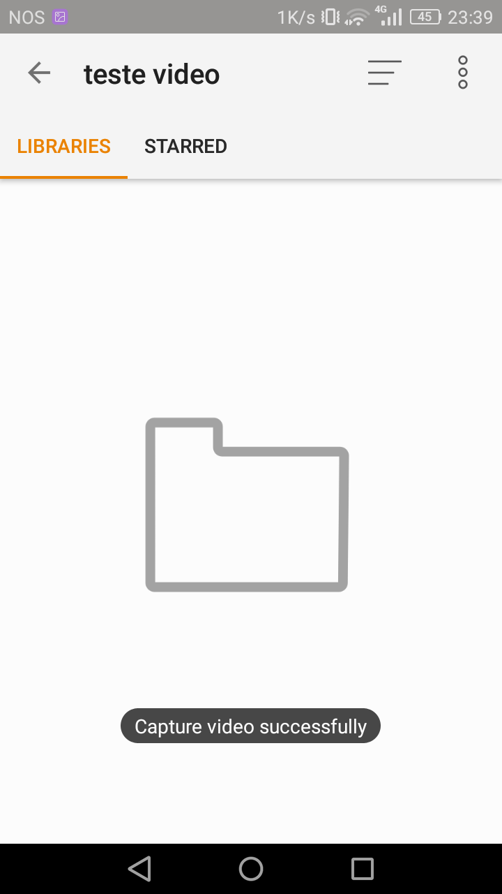


Se o *upload* do vídeo for realizado com sucesso o vídeo ficará com a extensão *.mp4 e o formato AnoMesDiaHorasMinutosSegundos

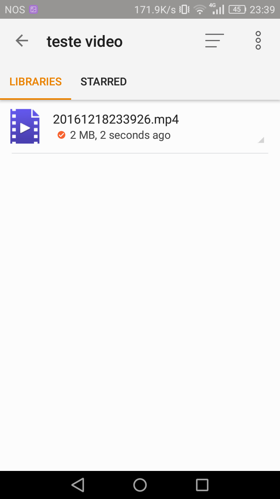


#### **Implementação**


Na aplicação android havia uma opção de tirar uma fotografia diretamente da aplicação e dar upload para uma pasta. Assim, nós pensámos que a implementação de tirar um vídeo diretamente da aplicação, embora não estar na "wishlist" deles, enquadrava-se na aplicação.
A nível de código, com os trabalhos passados, tinhamos ligeiramente noção onde eram implementadas certas funcionalidades, sendo a que nos interessava era uma função do browser que era tirar uma foto, assim fomos ver o exemplo de código que permitia tirar uma fotografia e orientámo-nos por aí.
A partir do código base fomos pesquisar o que seria necessário alterar para criar esta nova feature.

Começamos por adicionar um botão na lista de opções de add para começar a filmar.

```java
private void addFile() {
        final AlertDialog.Builder builder = new AlertDialog.Builder(this);
        builder.setTitle(getString(R.string.add_file));
        builder.setItems(R.array.add_file_options_array, new DialogInterface.OnClickListener() {
            @Override
            public void onClick(DialogInterface dialog, int which) {
                if (which == 0) // create file
                    showNewFileDialog();
                else if (which == 1) // create folder
                    showNewDirDialog();
                else if (which == 2) // upload file
                    pickFile();
                else if (which == 3) // take a photo
                    CameraTakePhoto();
                else if (which == 4) // capture a video
                    CameraCaptureVideo();
            }
        }).show();
    }
    
``` 

De seguida, com base no código que eles já tinham para tirar uma fotografia, criamos uma função para fazer um vídeo, como podemos ver nos seguintes blocos de código:
```java
private File takeCameraPhotoTempFile;

    private void CameraTakePhoto() {
        Intent imageCaptureIntent = new Intent("android.media.action.IMAGE_CAPTURE");

        try {
            File ImgDir = DataManager.createTempDir();

            String fileName = new SimpleDateFormat("yyyyMMddHHmmss").format(new Date()) + ".jpg";
            takeCameraPhotoTempFile = new File(ImgDir, fileName);

            Uri photo = Uri.fromFile(takeCameraPhotoTempFile);
            imageCaptureIntent.putExtra(MediaStore.EXTRA_OUTPUT, photo);
            startActivityForResult(imageCaptureIntent, TAKE_PHOTO_REQUEST);

        } catch (IOException e) {
            showShortToast(BrowserActivity.this, R.string.unknow_error);
        }
    }
    
```   

```java

private File captureCameraVideoTempFile;

    private void CameraCaptureVideo() {
        Intent videoCaptureIntent = new Intent("android.media.action.VIDEO_CAPTURE");

        try {
            File VideoDir = DataManager.createTempDir();

            String fileName = new SimpleDateFormat("yyyyMMddHHmmss").format(new Date()) + ".mp4";
            captureCameraVideoTempFile = new File(VideoDir, fileName);

            Uri video = Uri.fromFile(captureCameraVideoTempFile);
            videoCaptureIntent.putExtra(MediaStore.EXTRA_OUTPUT, video);
            startActivityForResult(videoCaptureIntent, CAPTURE_VIDEO_REQUEST);

        } catch (IOException e) {
            showShortToast(BrowserActivity.this, R.string.unknow_error);
        }
    }
```

```java

case TAKE_PHOTO_REQUEST:
            if (resultCode == RESULT_OK) {
                showShortToast(this, getString(R.string.take_photo_successfully));
                if (!Utils.isNetworkOn()) {
                    showShortToast(this, R.string.network_down);
                    return;
                }

                if(takeCameraPhotoTempFile == null) {
                    showShortToast(this, getString(R.string.saf_upload_path_not_available));
                    Log.i(DEBUG_TAG, "Pick file request did not return a path");
                    return;
                }
                showShortToast(this, getString(R.string.added_to_upload_tasks));
                final SeafRepo repo = dataManager.getCachedRepoByID(navContext.getRepoID());
                if (repo != null && repo.canLocalDecrypt()) {
                    addUploadBlocksTask(navContext.getRepoID(), navContext.getRepoName(), navContext.getDirPath(), takeCameraPhotoTempFile.getAbsolutePath(), repo.encVersion);
                } else {
                    addUploadTask(navContext.getRepoID(), navContext.getRepoName(), navContext.getDirPath(), takeCameraPhotoTempFile.getAbsolutePath());
                }

            }
            break;
            
```   

```java
case CAPTURE_VIDEO_REQUEST:
                if (resultCode == RESULT_OK) {
                    showShortToast(this, getString(R.string.capture_video_successfully));
                    if (!Utils.isNetworkOn()) {
                        showShortToast(this, R.string.network_down);
                        return;
                    }

                    if(captureCameraVideoTempFile == null) {
                        showShortToast(this, getString(R.string.saf_upload_path_not_available));
                        Log.i(DEBUG_TAG, "Pick file request did not return a path");
                        return;
                    }
                    showShortToast(this, getString(R.string.added_to_upload_tasks));
                    final SeafRepo repo = dataManager.getCachedRepoByID(navContext.getRepoID());
                    if (repo != null && repo.canLocalDecrypt()) {
                        addUploadBlocksTask(navContext.getRepoID(), navContext.getRepoName(), navContext.getDirPath(), captureCameraVideoTempFile.getAbsolutePath(), repo.encVersion);
                    } else {
                        addUploadTask(navContext.getRepoID(), navContext.getRepoName(), navContext.getDirPath(), captureCameraVideoTempFile.getAbsolutePath());
                    }

                }
                break;
```

---
<a name="pullrequest"/>
## **Pull Request**

O link para o **PULL REQUEST** encontra-se apresentado abaixo. O mesmo encontra-se ainda em aberto e não fomos contactados por nenhum membro da equipa do projeto.
A build encontra-se assinalada como *failing* devido aos aspetos mencionados no relatório anterior apresentado, sem estar relacionados com a adição de código proposta.

https://github.com/haiwen/seadroid/pull/603


---
<a name="contribuition"/>
## **Contribuição do Grupo**

A contribuição de todos os elementos do grupo foi igual.
